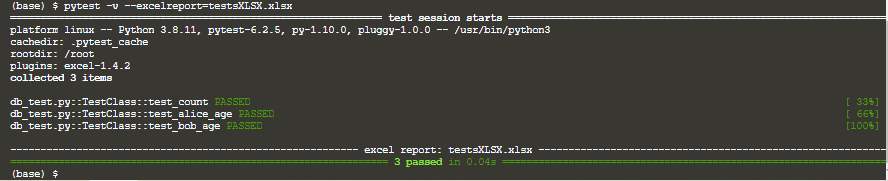
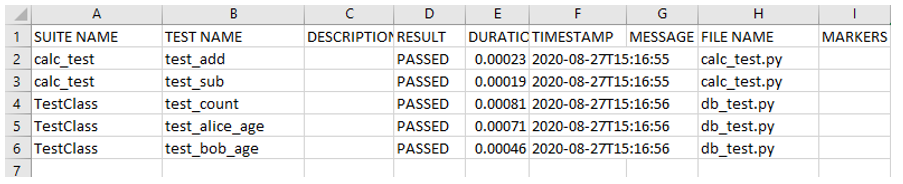

## Output Format

- Excel Output

To allow the test results to be exported to excel format, install `pytest-excel` using `pip install`:
> `pip install pytest-excel`{{execute}}

Run tests and report the result in excel format:
> `pytest -v --excelreport=testsXLSX.xlsx`{{execute}}

In general, you can open the generated excel document in your root folder. Check whether the file is created:
> `ls`{{execute}}

 

------------------------------------------

 

- CSV Output

Except excel format, we can export to csv format by installing `pytest-csv`:
> `pip install pytest-csv`{{execute}}

Run tests and report the result in csv format:
> `py.test -v --csv testsCSV.csv`{{execute}}

Check whether the file is created:
> `ls`{{execute}}

View the content by the `cat` command:
> `cat testsCSV.csv`{{execute}}

 

------------------------------------------

 

- XML Output

To output the test results in XML format:
> `pytest  --junit-xml testsXML.xml`{{execute}}

Check whether the file is created:
> `ls`{{execute}}

View the content by the `cat` command:
> `cat testsXML.xml`{{execute}}

 

------------------------------------------

 

In this example, **pytest** is running without specifying the test script. It will scan all the test scripts (e.g. python scripts with the name ending with \_test)  in the folder and execute all the test methods.

 
