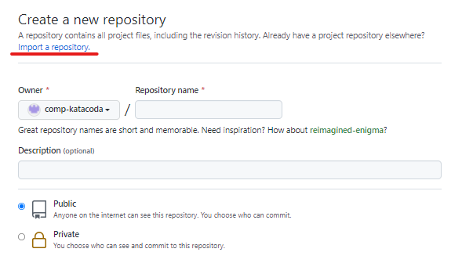
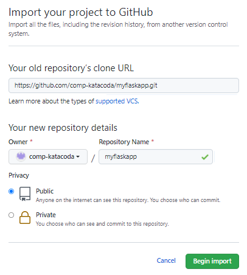
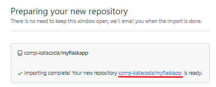
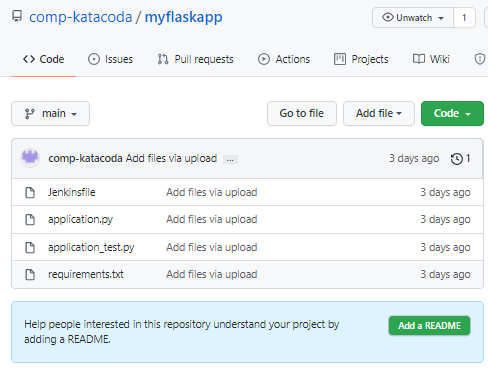

# Preparation

----------------------------------

### Open GitHub account and clone repository

Login your GitHub account (If you don't have one, create it before you continue this step.) Create a new public repository and click the link **Import a repository**:

Copy the clone URL `https://github.com/comp-katacoda/myflaskapp.git`{{copy}} and place under "Your old repository's clone URL". Fill in Repository Name as "_myflaskapp_". Click "Begin import":

Click on the link to open your repository:

You should see four files inside the repository:

 
