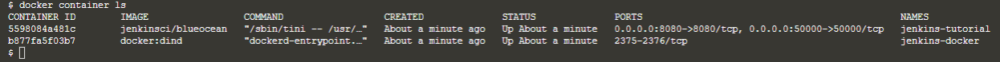

## Start and setup Jenkins

Create a [bridge network](https://docs.docker.com/network/bridge/) in Docker using the following [docker network create](https://docs.docker.com/engine/reference/commandline/network_create/) command:
> `docker network create jenkins`{{execute}}

Create the following volumes  to share the Docker client TLS certificates needed to connect to the Docker daemon and persist the Jenkins data using the following [docker volume create](https://docs.docker.com/engine/reference/commandline/volume_create/) commands:
> `docker volume create jenkins-docker-certs`{{execute}}
>
> `docker volume create jenkins-data`{{execute}}

In order to execute Docker commands inside Jenkins nodes, download and run the **docker:dind** Docker image. Specify your location to **/root** folder:
> `docker run --name jenkins-docker --rm --detach   --privileged --network jenkins --network-alias docker   --env DOCKER_TLS_CERTDIR=/certs   --volume jenkins-docker-certs:/certs/client   --volume jenkins-data:/var/jenkins_home   --volume /root docker:dind`{{execute}}

Run the jenkinsci/blueocean image as a container in Docker using the following docker container run command. Specify your location to **/root** folder:
>  `docker container run --name jenkins-tutorial --rm --detach --network jenkins --env DOCKER_HOST=tcp://docker:2376   --env DOCKER_CERT_PATH=/certs/client --env DOCKER_TLS_VERIFY=1   --volume jenkins-data:/var/jenkins_home   --volume jenkins-docker-certs:/certs/client:ro   --volume /root  --publish 8080:8080 --publish 50000:50000 jenkinsci/blueocean`{{execute}}

Check that the two containers are running:
> `docker container ls`{{execute}}

Examine the Jenkins console log for the automatically-generated alphanumeric **password** (between the 2 sets of asterisks). Copy the password.
> `docker logs jenkins-tutorial`{{execute}}

You may access the Jenkins/Blue Ocean container (through a separate terminal/command prompt window) with a docker container exec command:
> `docker container exec -it jenkins-tutorial bash`{{execute}}
> 
> `exit`{{execute}}

 
