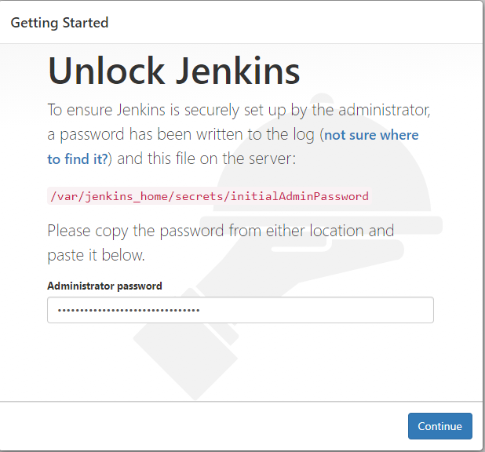
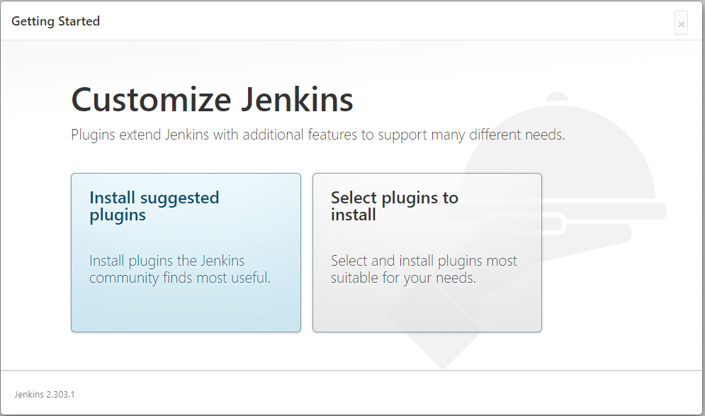
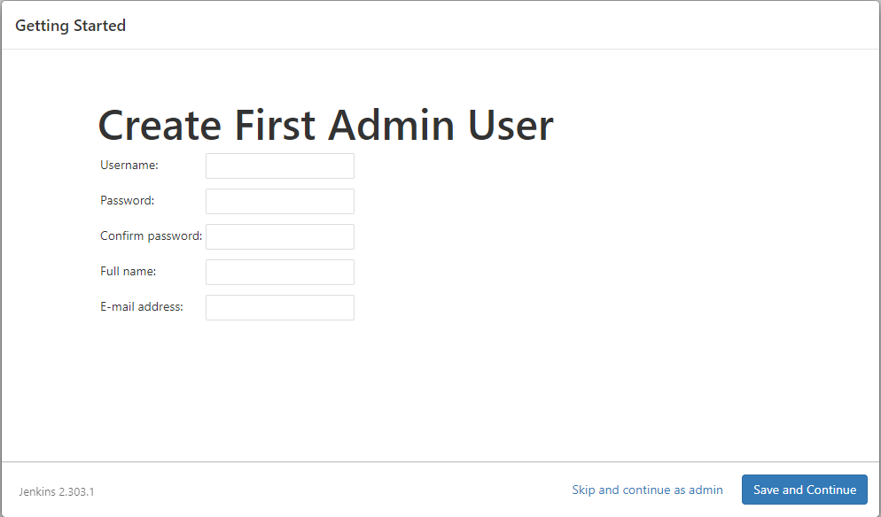
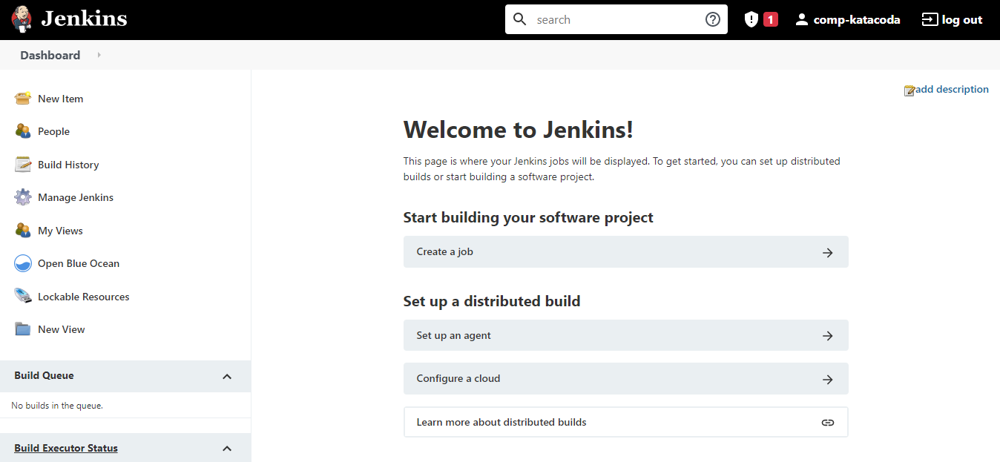

# Logging in Jenkins on browser

Click the **Jenkins dashboard** on the terminal tab to navigate.

Login in with the password, which is the one generated before between the 2 sets of asterisks.

Click **Install suggested plugins**. Wait it to finish loading.

Jenkins will then ask you to create your first administrator user. Specify your details in the respective fields and click **Save and Finish**. Load until the **Jenkins is ready** page appears, click **Start using Jenkins**.

The dashboard is shown at last.

 
