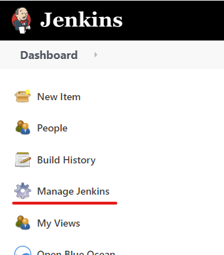
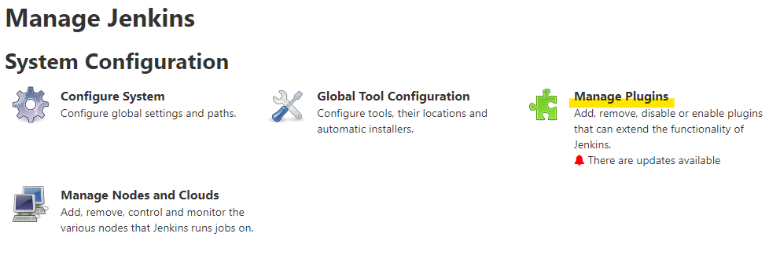
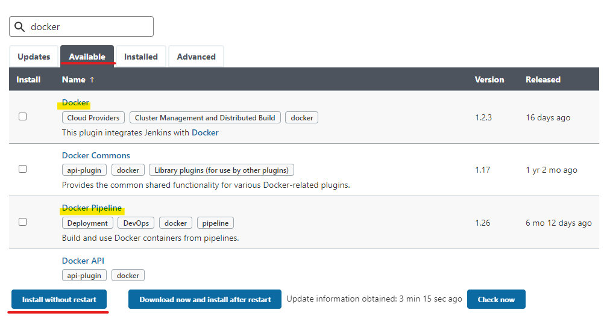
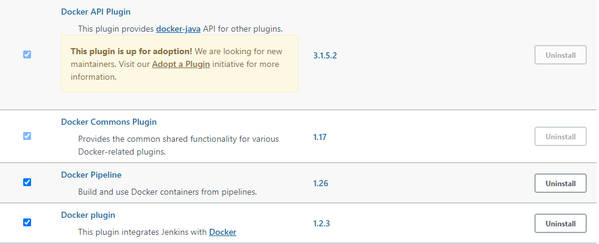

## Install Plugins

Click **Manage Jenkins**.

Click **Manage Plugins**.

Click the **Available** tab. Search `Docker`{{copy}} and `Docker Pipeline`{{copy}}. Select both of them and click **Install without restart**.

Check whether the plugins are installed by selecting **Installed** tab. You should see the following four plugins.

Return to dashboard.

 
