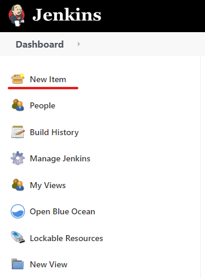

# Creating a Jenkin pipeline

----------------------------------

### Create the pipeline project

Focus on the Jenkins website. Click **New Item** at the top left.

In the **Enter an item name** field, specify the name for your new Pipeline project (e.g. myflaskapp_pipeline). Scroll down and click **Pipeline**. Click **OK** at the end of the page.

Click the **Pipeline** tab at the top of the page. 

From the **Definition** field, choose the **Pipeline script from SCM** option. This option instructs Jenkins to obtain your Pipeline from Source Control Management (SCM), which will be your locally cloned Git repository. From the **SCM** field, choose **Git**.

In the **Repository URL** field, specify the URL of your git repository:
https://github.com/<\YOUR-GITHUB-ACCOUNT-NAME\>/<\YOUR REPOS NAME\> 
where <YOUR-GITHUB-ACCOUNT-NAME> and <YOUR REPOS NAME> is your Github account name and repository name respectively. 
  

  
Also, change **Branch Specifier (blank for 'any')** field to `*/main`{{copy}}.

The **script path** parameter defines that the stages and steps in the pipeline are defined **Jenkinsfile** in the Git repository.

Refer to the following as an example Jenkinsfile.

  
The pipeline consists of two stages:
- Build stage: Setup/activate the python virtual environment and install the dependencies (the python libraries required are specified in requirements.txt).
  
  

- Test stage: Execute the unit tests which are defined in **application_test.py**. The test results are output as junit-xml format. The post step is for asking the Jenkin to archive the test results.

Click **Save** to save your new Pipeline project.

 
