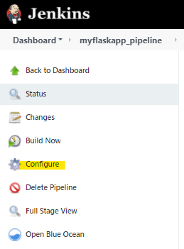
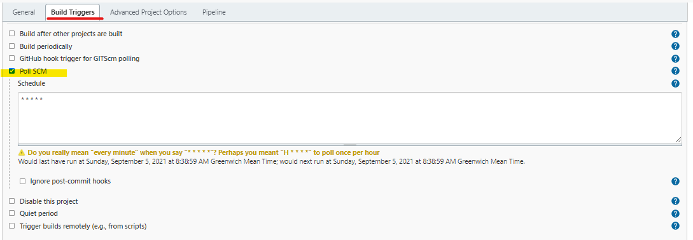
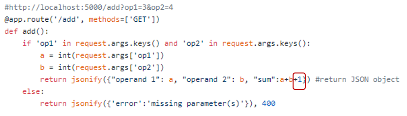
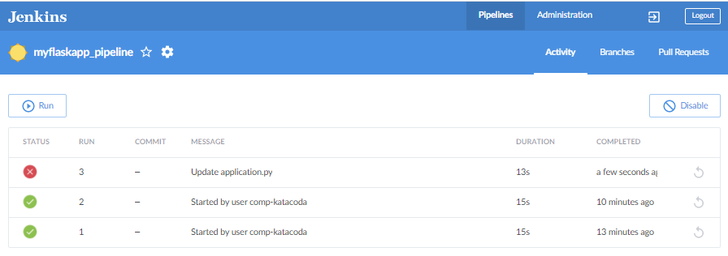
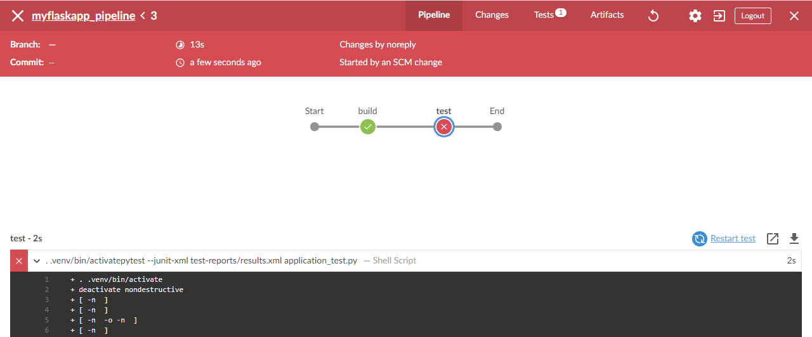
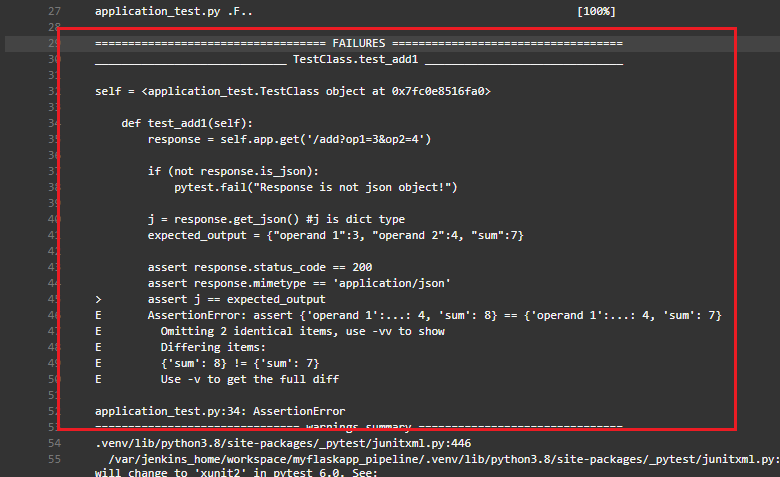
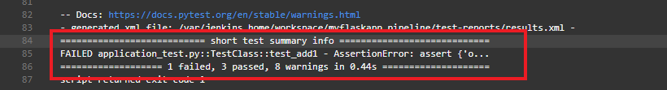
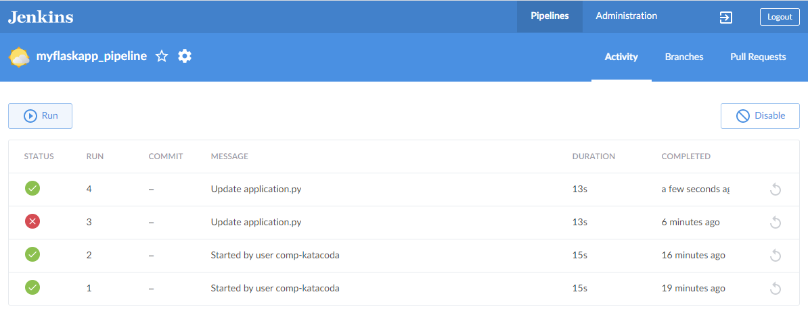
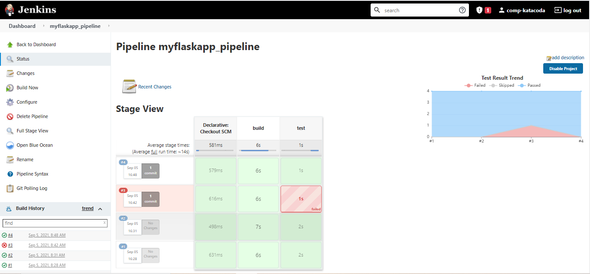

### Build Triggers

In the classic pipeline view in Jenkins, click **Configure**.

Click the **Build Trigger** tab at the top of the page to scroll down to the **Build Trigger** section. Check “_Poll SCM_” and specify the cron expression `* * * * *`{{copy}} in the **Schedule** text box we can get Jenkins to poll the repository for changes every minute. 

Click **Save**.

In your GitHub repository, edit **application.py** to introduce a bug in the script.

Click **Commit Change** to commit the change to the main branch.

Go back to the **Open Blue Ocean view** in Jenkins. Jenkins will poll Github every one minute for new commits and trigger the pipeline.

The red colour indicates that there is a failed step in the pipeline.

Example console output:

Correct the bug in GitHub and commit change. The new commit will trigger the pipeline which should be executed successfully.

Navigate back to the classic pipeline view in Jenkins.

 
